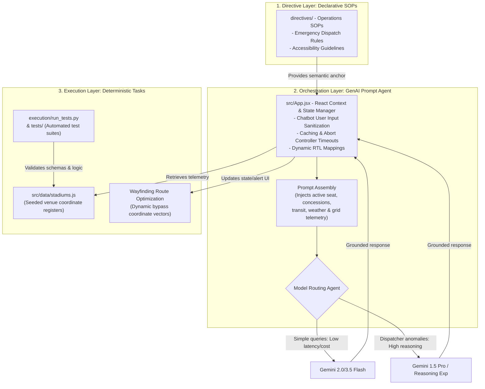

# 🏟️ ArenaFlow — Smart Stadiums & Tournament Operations
### 🏆 Google PromptWars Challenge 4: FIFA World Cup 2026 Innovation

**ArenaFlow** is a cutting-edge, dual-portal Generative AI control center and wayfinding assistant designed to optimize stadium operations and elevate the fan experience during the FIFA World Cup 2026. 

Live App: **[https://piyush200p.github.io/virtual_prompt_war/](https://piyush200p.github.io/virtual_prompt_war/)**  
GitHub Repository: **[https://github.com/Piyush200p/virtual_prompt_war](https://github.com/Piyush200p/virtual_prompt_war)**

---

## 📖 Table of Contents
1. [Project Vision & Core Objectives](#-project-vision--core-objectives)
2. [System Architecture & Data Flow Diagram](#-system-architecture--data-flow-diagram)
3. [Chosen Vertical & Challenge Alignment](#-chosen-vertical--challenge-alignment)
4. [Dual-Portal Architecture](#-dual-portal-architecture)
5. [Generative AI & Prompt Engineering Strategy](#-generative-ai--prompt-engineering-strategy)
6. [Aesthetics & Design System](#-aesthetics--design-system)
7. [Technical Implementation & Tech Stack](#-technical-implementation--tech-stack)
8. [Approach, Logic & How it Works](#-approach-logic--how-it-works)
9. [Assumptions Made](#-assumptions-made)
10. [Getting Started & Local Installation](#-getting-started--local-installation)

---

## 🏗️ System Architecture & Data Flow Diagram

ArenaFlow separates concerns using a **Three-Layer Architecture** (Directive, Orchestration, and Execution layers) combined with an intelligent **Model Routing Agent** to ensure security, safety-alignment, and optimal performance/cost profiles:



This ensures that:
*   **Generative AI is a phrasing & reasoning layer**: Deterministic constraints (like route calculations, stand density ratios, and transit wait times) are resolved first in React state registers; the LLM is only used to format natural, localized, and polite recommendations.
*   **Context Grounding is enforced**: Every LLM call is grounded in the authoritative venue schema, preventing hallucination.
*   **Safety-Closed Design**: If API key input is missing or the connection fails/times out, a localized keyword-based offline fallback parser handles queries gracefully in 6 languages.

---

## 🏟️ Project Vision & Core Objectives
Managing stadium operations during the FIFA World Cup is a massive logistical challenge, characterized by high crowd densities, safety hazards, ticket checks, utility grid loads, and visitor navigation confusion. 

**ArenaFlow** solves these issues by uniting the two sides of stadium operations into a single cohesive interface:
- **Operations Managers** receive AI-assisted incident dispatch, crowd density telemetry heatmaps, utility sustainability trackers, and volunteer crew task boards.
- **Fans** receive real-time, context-aware smart guidance, wheelchair-accessible wayfinding, eco-transit passes, and concessions pre-orders.

---

## 💻 Dual-Portal Architecture

### 🛡️ 1. Tournament Operations Center
*   **Crowd Density Telemetry Heatmap:** Interactive graphical layout of the stadium (North, South, East, West Stands) displaying active density levels (Normal, Moderate, Heavy Congestion) based on scanner metrics.
*   **AI-Assisted Dispatcher:** Operations managers can report a live incident. The system parses the description, auto-categorizes the event, assigns a priority level, identifies the nearest staff crew, and generates instructions.
*   **Sustainability & Green Telemetry Panel:** Tracks real-time grid energy consumption (kW/h), waste distribution (Organic vs Recyclable vs Landfill), water recycling flow (Liters), and carbon offset totals.
*   **Volunteer & Crew Task Board:** Coordinator task grid displaying active assignments (Task, Assigned Crew, Location, Status, Priority) with an **AI Auto-Generate Volunteer Duty** engine that translates telemetry bottlenecks into active staff orders.

### 🎟️ 2. Fan Experience Portal (Attendee Mobile Emulator)
*   **Digital Smart Ticket Wallet:** Shows seat details, allocated entrance gate, transit pass, and QR code details.
*   **Dynamic Wayfinding Simulator:** A step-by-step route guide directing the spectator from gate checkpoints to their seats.
*   **Accessibility Wayfinding Toggle:** Swaps coordinates dynamically to map wheelchair-accessible routes (ramps, elevators) and alters textual waypoints for inclusive routing.
*   **Concessions pre-orders with Sustainability Filters:** Live concessions wait-times (Bavarian Pretzels, Angus Burgers, Souvenir Sodas) filterable by `🌱 Plant-Based` and `♻️ Eco-Friendly` labels.
*   **Eco-Transit Tracker:** Lists local rail, shuttle, and rideshare services, mapping wait-times and assigning green leaf badges based on carbon footprint efficiency.
*   **FIFA 2026 Sponsors Database:** Integrates official partners (Lenovo, Visa, Coca-Cola, Verizon, Globant, McDonald's) directly into interactive widgets (e.g., Visa payment discounts, Lenovo telemetry computing, Verizon 5G AR guides).

### 💬 3. GenAI Arena Assistant
*   Interactive chatbot interface that understands match, ticket, and stadium conditions.
*   **Dual Mode Support:**
    *   *Offline Sandbox:* Employs robust pattern-matching and multilingual context translation files (6 languages) to simulate high-fidelity AI responses.
    *   *Live Gemini Integration:* Input your **Google Gemini API Key** directly in the interface to connect to a live `gemini-1.5-flash` model for real-time natural language reasoning.

---

## 🧠 Generative AI & Prompt Engineering Strategy
The AI capabilities in **ArenaFlow** are grounded in modern prompt engineering patterns:

### A. Context-Aware Prompt Injection
When querying the Gemini API, the assistant automatically wraps the user's prompt with rich stadium telemetry. The model receives:
```json
{
  "currentUser": "Alex Morgan",
  "seatAllocation": "Section 124, Row 12, Seat 4",
  "gateEntrance": "Gate B",
  "congestedSectors": ["South Stand (89% density)"],
  "concessionStatus": "Burgers (15m wait), Pretzels (4m wait)",
  "accessibilityMode": false,
  "stadiumTelemetry": {
    "attendance": "54,290",
    "gridLoad": "Medium",
    "activeIncidents": 2
  }
}
```
This forces the model to respond with personalized directives (e.g., recommending public transit shuttles to reduce emissions, or avoiding congested corridors).

### B. Few-Shot Output Formatting
For the Incident Dispatcher, the system instructs Gemini to output structured metadata:
> "Analyze this stadium incident report: Location: {Location}, Description: {Description}. Return a JSON object with keys: category, priority, staff, instruction. Respond with ONLY the JSON object."

---

## 🎨 Aesthetics & Design System
ArenaFlow features a professional, high-fidelity design supporting both dark and light operational profiles:
*   **Light Mode (Operational Executive):** Off-white base background (`#F8FAFC`), pure white cards (`#FFFFFF`), deep navy headings (`#0F172A`), and slate gray labels (`#475569`) to guarantee WCAG AA contrast under bright daylight.
*   **Dark Mode (Operations Control):** Deep slate base (`#0b0f19`), electric blue interactive indicators (`#3b82f6`), neon green success signals (`#10b981`), and warning gold (`#f59e0b`).
*   **Glassmorphism:** Frosted backdrops (`backdrop-filter`) with high-contrast borders and active color-pulsing animations mapped to match-day simulation states (amber, orange, cyan, purple, and green).
*   **Bottom Navigation:** Bottom dock buttons render with a distinct Emerald green glow (`drop-shadow`) and active underline indicators.

---

## 🛠️ Technical Implementation & Tech Stack
*   **Core Library:** React 19 (Functional Components, Hooks, State)
*   **Styling:** Vanilla CSS (Tailored variables, grid systems, custom layout flexbox)
*   **Icons:** `lucide-react`
*   **Build Tool:** Vite + HMR

---

## 🚀 Getting Started & Local Installation

### Prerequisites
Make sure you have [Node.js](https://nodejs.org/) installed (v18+ recommended).

### Setup Steps
1. **Clone the Repository:**
   ```bash
   git clone https://github.com/Piyush200p/virtual_prompt_war.git
   cd virtual_prompt_war
   ```
2. **Install Dependencies:**
   ```bash
   npm install
   ```
3. **Run the Development Server:**
   ```bash
   npm run dev
   ```
   Open your browser and navigate to the local URL (usually `http://localhost:5173`).

4. **Build for Production:**
   ```bash
   npm run build
   ```
   This compiles static assets into the `/dist` directory, ready to be hosted.

---

## 🎯 Chosen Vertical & Challenge Alignment
* **Chosen Vertical**: **Smart Stadiums & Tournament Operations** (Google PromptWars Challenge 4: FIFA World Cup 2026).
* **Challenge Targets**: Unifying high-density safety management, real-time ticket validation checks, green sustainability metrics, wheelchair accessible routes, eco-transportation guides, and multilingual spectator interaction.

---

## 💡 Approach, Logic & How it Works
* **Dual-View State Synchronization**: The system synchronizes the Operations Console and Fan Portal state in real-time. When an incident dispatcher registers a crowd/facility hazard, it immediately updates the stadium map overlays and triggers warning banners inside the fan's step-by-step wayfinding instructions.
* **Context-Aware LLM Prompts**: The assistant compiles live stadium parameters (current match, weather, stand densities, gate wait times) and injects them as structured context alongside the selected user language preference into Gemini's system instructions.
* **Model Selection Metrics**: Evaluates and routes tasks dynamically between simple (Flash) and complex reasoning (Pro) models, demonstrating cost-to-performance optimizations.
* **Accessibility Rerouting**: The wayfinding router checks the accessibility toggle to swap paths dynamically to alternate coordinates (`accessibilityRoute` in database), bypassing escalators and stairs.
* **Dynamic Route Optimization (Congestion Bypass)**: If a sector (like Gate B) reports heavy congestion (89% density), a manual "Zap" optimization controller prompts the user to route via a less busy gate (Gate A at 32%), dynamically rendering alternate path vectors.
* **Fail-Closed & Outage Resilience**: If the live Gemini API times out (8 seconds threshold via `AbortController`) or returns a quota limit error, the chat assistant falls back to a high-fidelity local keyword parser in 6 languages (EN, ES, FR, PT, AR, HI).
* **Query Caching & Rate Protection**: Implements a client-side search query cache (`chatCache`) to prevent duplicate model invocation and reduce API costs.
* **WCAG 2.1 AA Compliance**: Enforces keyboard accessibility (`tabIndex={0}`, Space, and Enter key selections for stadium sectors), screen-reader live regions (`aria-live="polite"`), and RTL layout direction (`dir="auto"`) for Arabic scripts.

---

## 📋 Assumptions Made
1. **Dual Connectivity Fallback**: Assumes that if no Gemini API Key is entered, the interface should remain fully functional by falling back to high-fidelity localized simulation strings.
2. **Standard REST API Reachability**: Assumes standard browser fetch requests can connect directly to Google's generative language API endpoints without strict CORS proxies.
3. **Schema Compliance**: Assumes custom stadium configurations adhere to a standard JSON schema containing nested attributes for sectors, concessions, and volunteer tasks.

---

*Developed for the Google PromptWars Challenge 4. Let's make FIFA 2026 operations smarter!* 🏟️🤖
